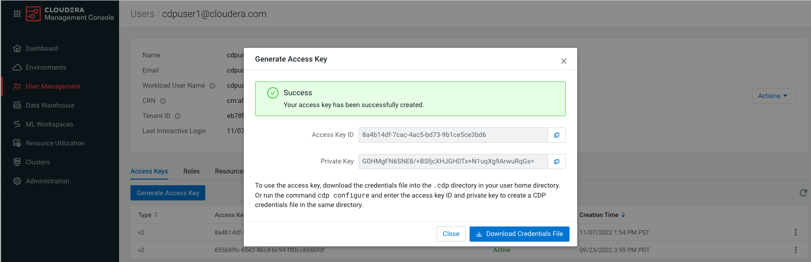
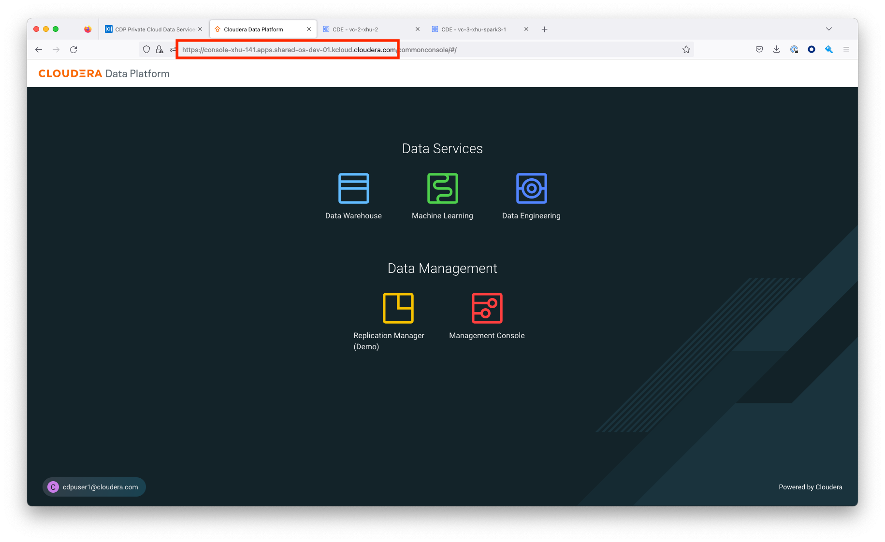

# Drop-in Replacement CDE-ENV Tool

## 1. Artifacts
### 1.1 Deliverable
The deliverable is `cde-env.zip`, and it is hosted in `https://<cde-service-url>/downloads/cde-env/latest/<platform>/cde-env.zip`
### 1.2 Supported platforms (due to shell-scripts used, no Windows supported)
1. Unix
2. MacOS

### 1.3 Contents
Once `unzip` the archive, you will see a folder called `cde-env-tool`.
```bash
cde-env-tool
├── README.pdf
├── cde
├── cde-env.sh
├── spark-submit-cde
└── spark3-submit-cde

0 directories, 5 files
```

## 2. Installation (Persona: admin)

### 2.1 Package installation
1. Public cloud

```bash
$ ./cde-env.sh enable-spark-submit-proxy
```

2. Private cloud

```bash
$ ./cde-env.sh enable-spark-submit-proxy -f private
```

### 2.2 Package enablement (require manual actions from the customer)
The executables are installed under the `/opt/cloudera/bin` folder. Please use one of the following options to enable the installed spark-submit script.
1. patch the existing `/usr/bin/spark-submit` and `/usr/bin/spark3-submit`
```bash
$ ln -s /opt/cloudera/bin/cde /usr/bin/cde
$ ln -s /opt/cloudera/bin/cde-env.sh /usr/bin/cde-env.sh
$ ln -s -f /opt/cloudera/bin/spark-submit /usr/bin/spark-submit
$ ln -s -f /opt/cloudera/bin/spark3-submit /usr/bin/spark3-submit
```
2. update `PATH` to point to the new installation location at the host level
```bash
$ export PATH=/opt/cloudera/bin:$PATH
```
3. Any other choice that the customers see fit

## 3. Configuration (Persona: regular user)

### 3.1 Prerequisites

1. accesskey for the user



2. virtual cluster url


3. cdp endpoint



### 3.2 Add profile for each user

Manually edit the `~/.cde/config.yaml` file

#### 3.2.1 public cloud
```yaml
# ~/.cde/config.yaml

allow-all-spark-submit-flags: true
credentials-file: /home/cdpuser1/.cde/credentials # <credentials-location>
cdp-endpoint: https://console-xhu-141.apps.shared-os-dev-01.kcloud.cloudera.com # <CDP-endpoint>

profiles:
  - name: vc-2 # <profile-name>
    vcluster-endpoint: https://5b27g4jm.cde-x6j2nh5j.apps.apps.shared-os-dev-01.kcloud.cloudera.com/dex/api/v1 # <VC-endpoint>
  - name: spark3-1 # <profile-name>
    vcluster-endpoint: https://7j92n8q4.cde-smstx27m.apps.apps.shared-os-dev-01.kcloud.cloudera.com/dex/api/v1 # <VC-endpoint>
```

#### 3.2.2 private cloud
```yaml
# ~/.cde/config.yaml

allow-all-spark-submit-flags: true
credentials-file: /home/cdpuser1/.cde/credentials # <credentials-location>
cdp-endpoint: https://console-xhu-141.apps.shared-os-dev-01.kcloud.cloudera.com # <CDP-endpoint>
tls-insecure: true

profiles:
  - name: vc-2 # <profile-name>
    vcluster-endpoint: https://5b27g4jm.cde-x6j2nh5j.apps.apps.shared-os-dev-01.kcloud.cloudera.com/dex/api/v1 # <VC-endpoint>
  - name: spark3-1 # <profile-name>
    vcluster-endpoint: https://7j92n8q4.cde-smstx27m.apps.apps.shared-os-dev-01.kcloud.cloudera.com/dex/api/v1 # <VC-endpoint>
```

## 4. Usage (Persona: regular user)

### 4.1 Activate Profile
```bash
$ cde-env.sh activate -p <profile-name>
```
run spark jobs on YARN (yarn is a reserved profile name)
```bash
$ cde-env.sh activate -p yarn
```
run spark jobs on CDE
```bash
$ cde-env.sh activate -p vc-1
```
### 4.2 Sample spark-submit Command
```bash
$ spark-submit --name pt_rpt_streams --master=yarn --deploy-mode=cluster --driver-memory 4G --executor-memory 4G --executor-cores 3 --num-executors 4 --files "$HOME/spark-sql.py" --conf "spark.executor.extraJavaOptions=-Djava.security.auth.login.config=/home/hdpsparkprd/spark-hdpsparkprd-keytab-jaas.conf -Djava.security.krb5.conf=/etc/krb5.conf -Djavax.security.auth.useSubjectCredsOnly=true" --conf "spark.driver.extraJavaOptions=-Djava.security.auth.login.config=/home/hdpsparkprd/spark-hdpsparkprd-keytab-jaas.conf -Djava.security.krb5.conf=/etc/krb5.conf -Djavax.security.auth.useSubjectCredsOnly=true" --conf "spark.io.compression.codec=org.apache.spark.io.LZ4CompressionCodec" $HOME/spark-sql.py
```

```bash
$ spark3-submit --name pt_rpt_streams --master=yarn --deploy-mode=cluster --driver-memory 4G --executor-memory 4G --executor-cores 3 --num-executors 4 --files "$HOME/spark-sql.py" --conf "spark.executor.extraJavaOptions=-Djava.security.auth.login.config=/home/hdpsparkprd/spark-hdpsparkprd-keytab-jaas.conf -Djava.security.krb5.conf=/etc/krb5.conf -Djavax.security.auth.useSubjectCredsOnly=true" --conf "spark.driver.extraJavaOptions=-Djava.security.auth.login.config=/home/hdpsparkprd/spark-hdpsparkprd-keytab-jaas.conf -Djava.security.krb5.conf=/etc/krb5.conf -Djavax.security.auth.useSubjectCredsOnly=true" --conf "spark.io.compression.codec=org.apache.spark.io.LZ4CompressionCodec" $HOME/spark-sql.py
```

### 4.3 Calling spark-submit command with inline profile config
```bash
$ CDE_CONFIG_PROFILE=yarn spark-submit --name pt_rpt_streams --master=yarn --deploy-mode=cluster --driver-memory 4G --executor-memory 4G --executor-cores 3 --num-executors 4 --files "$HOME/spark-sql.py" --conf "spark.executor.extraJavaOptions=-Djava.security.auth.login.config=/home/hdpsparkprd/spark-hdpsparkprd-keytab-jaas.conf -Djava.security.krb5.conf=/etc/krb5.conf -Djavax.security.auth.useSubjectCredsOnly=true" --conf "spark.driver.extraJavaOptions=-Djava.security.auth.login.config=/home/hdpsparkprd/spark-hdpsparkprd-keytab-jaas.conf -Djava.security.krb5.conf=/etc/krb5.conf -Djavax.security.auth.useSubjectCredsOnly=true" --conf "spark.io.compression.codec=org.apache.spark.io.LZ4CompressionCodec" $HOME/spark-sql.py
```

```bash
$ CDE_CONFIG_PROFILE=vc-1 spark3-submit --name pt_rpt_streams --master=yarn --deploy-mode=cluster --driver-memory 4G --executor-memory 4G --executor-cores 3 --num-executors 4 --files "$HOME/spark-sql.py" --conf "spark.executor.extraJavaOptions=-Djava.security.auth.login.config=/home/hdpsparkprd/spark-hdpsparkprd-keytab-jaas.conf -Djava.security.krb5.conf=/etc/krb5.conf -Djavax.security.auth.useSubjectCredsOnly=true" --conf "spark.driver.extraJavaOptions=-Djava.security.auth.login.config=/home/hdpsparkprd/spark-hdpsparkprd-keytab-jaas.conf -Djava.security.krb5.conf=/etc/krb5.conf -Djavax.security.auth.useSubjectCredsOnly=true" --conf "spark.io.compression.codec=org.apache.spark.io.LZ4CompressionCodec" $HOME/spark-sql.py
```
